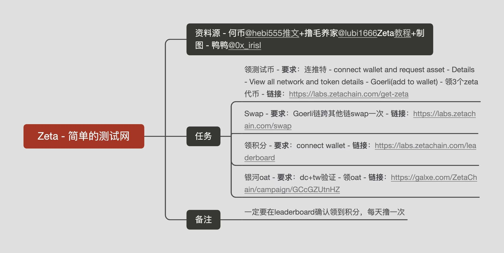
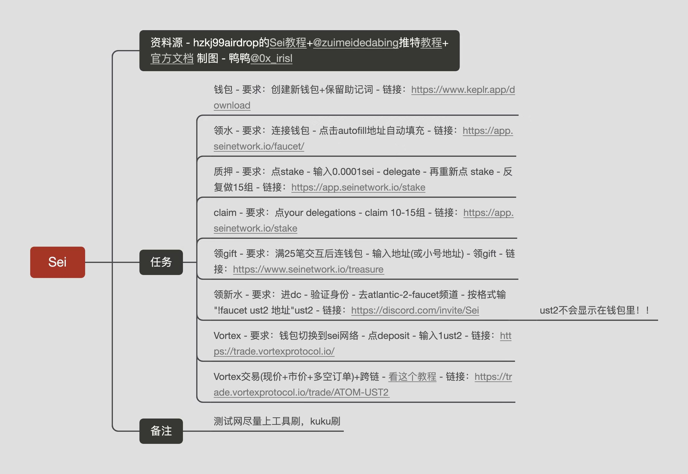

# 汇总及部分脚本

# 汇总及部分脚本
专心撸毛，不参与NFT了，精力不够

## 撸毛
  - 撸毛原则(参考何币大佬及群内老哥建议)
      > 1、成本越高越要撸。  
      2、越麻烦越要撸。  
      3、越难用越要撸。  
      4、越花时间越要撸。  
      5、越早期越要撸。  
      6、选择重要，努力更重要。
  - 精品号原则
      > 1，时间跨度 (最少两个月)  
      2，交易次数 (最少25次)  
      3，交易金额 (最少1WU)  
      4，主网交易  
      5，git捐款  

### zks
- https://twitter.com/11dizhu/status/1637097001711177729?s=46&t=EFmdYBHG8VUPPlgwC14ukw
- [5美元搞定ZigZag做市商机器人，附高成交率技巧（小白版） — LNP (mirror.xyz)](https://mirror.xyz/lnpandy.eth/oX6s3dp18GHr5Q0cG_V-zK4UBUsPJzaGdYS1ECsUsUY)
- https://www.toutiao.com/video/7214761705358918179/?app=news_article_lite&timestamp=1679910295&share_uid=MS4wLjABAAAACSbMN7wk3QNARksdXhiGGVs6rO05uUycQYsFDaLfC2o&share_token=2AA71615-A75C-4F07-BA5D-0F01D8B6015F&source=m_redirect&wid=1679923599788
- ZkSync主网交互教程
  https://mirror.xyz/allengege.eth/ce2RMsgiaQVJ8xUzWlwkZ5uJd8wIcZzYaCyHPnKv6U0
- ZkSync Era 测试网交互教程
   https://mirror.xyz/allengege.eth/0ImCseIxlnmvJ-KleQ7RclyMKYErFq46FFFlweJ3ofw

### starknet
- 任务一
  跨链-要求:
  跨eth到StarkNet-链接:
  官方桥，https://starkgate.starknet.io/
  OrbiterL2，https://www.orbiter.finance/?source=Optimism&dest=Starknet
  成本:9u(官方贵);1u
- 任务二
  资金交易-要求:
  钱包内swap+dex交互链接:
  Myswap，https://www.myswap.xyz/
  Jediswap，https://app.jediswap.xyz/
  10kswap，https://10kswap.com
  Starkswap，https://www.starkswap.co/app/starkswap/swap
  Alpharoad，https://testnet.app.alpharoad.fi/
- 任务三
  NFT交易-要求:
  创建NFT并买卖-链接:
  Aspect，https://aspect.co/create
  Mintsquare，https://mintsquare.io/mint
  成本:gas
- 任务四（选做）
  DID-要求:
  mint一个did nft-链接:
  https://app.starknet.id/identities
  成本:0.3u;DID-0.009e/年
- 任务五
  借贷-要求:
  借贷资金，链接:
  https://alpha.nostra.finance/
  成本:gas
- 任务六
  把资金跨回-要求:
  从StarkNet跨回其他链，留20u+在地址-链接:
  https://www.orbiter.finance/?source=Starknet&dest=Arbitrum
  成本:1u
- 任务七
  捐赠-要求:
  Gitcoin捐赠Starknet项目-链接:
  https://bounties.gitcoin.co/grants/5688/jediswap-first-amm-on-starknet-enabling-instantan
- 总结:
  一到两周可以交互两次，最好走一次官方跨链桥，总成本在10u-20u;
  交互-10次+;
  间隔-72h+;
  最好是至少5+天活跃;
  钱包余额-20u+

### Layerzero交互策略：
- https://twitter.com/Ecosystem10K/status/1636920662320381952?s=20

### Zeta

### SEI

### ALEO
#### 合约教程
- https://www.youtube.com/watch?v=EkNk7MnzA8s
- https://developer.aleo.org/testnet/getting_started/deploy_execute_demo/
- https://mirror.xyz/garysdevil.eth/BtAHrX9iJpF-3Y-DHDKFcXUbinwgIbb7lMnzv5xF5k0

### Namada
 - 公共测试网：https://namada.net/testnets

### 节点
#### SHM节点部署
  - https://mirror.xyz/7645666.eth/Gz6A1DUpNAPA2JzhBmfASAS0NzKaxqgOclivzZ7sBRI
  - https://discord.gg/shardeum
#### celestia 
  - 有顶级投资人Balaji和Polychain、Delphi、Blockchain、Spartan、Jump Crypto 、IOSG、A&T、、Figment
    Binance Labs 、Divergence、Maven11七家头部风投参投两轮融资5650万美金的模块化公链Celestia 测试激励网活动开始了，分1500万代币https://docs.celestia.org/nodes/blockspace-race/

#### monad 
  - 有Dragonfly(6)、Placeholder(28)、Lemniscap(86)、Shima(32)和顶级投资人Naval共四家头部机构参与仅种子轮就融资1900万刀的L1公链Monad跑节点填表 https://www.monad.xyz/validators
